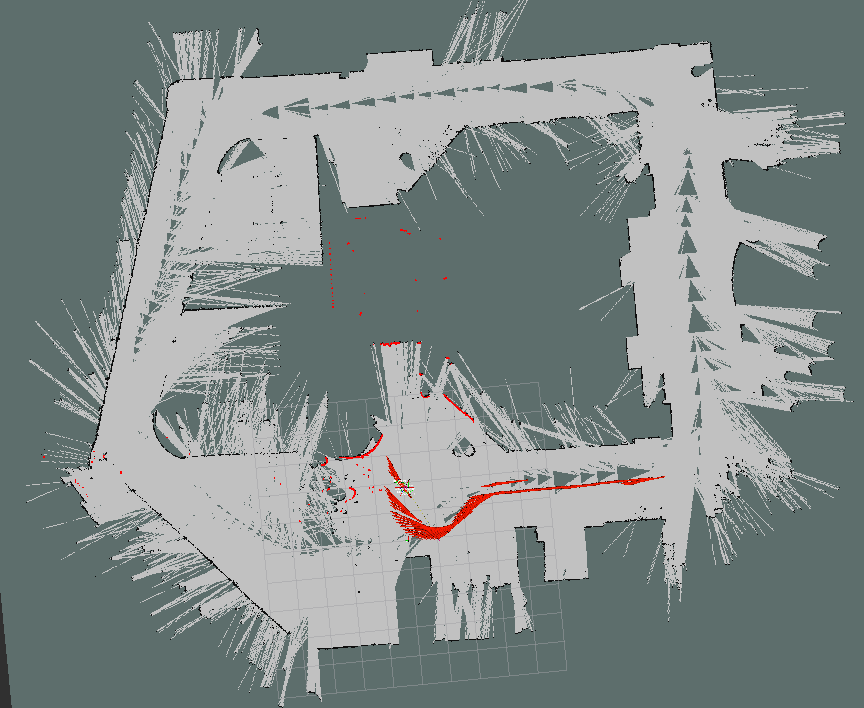
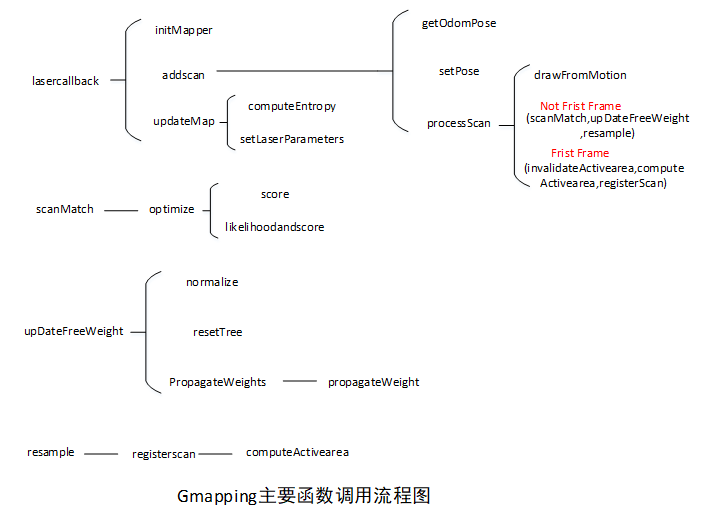

1.	本次的作业是梳理gmapping算法代码流程，对应第五课基于滤波的SLAM算法的pdf。
2.	第四课帧间匹配算法pdf的实现在第一期作业没有对应的代码实现，在里程计矫正的作业里有用到==CSM库里的sm_icp函数==实现过。

本次程序的运行过程为：

1.  运行指令：roslaunch  gmapping   gmapping_sim.launch
2.  进入到 /bag目录下，运行指令：rosbag play - -clock gmapping.bag。
3.  在rviz中查看建图结果。
4.  gmapping_sim.launch文件位于gmapping/slam_gmapping/gmapping/launch目录下。

PS：本次作业附带的gmapping的代码是有中文注释版本的代码。大家在完成作业，看gmapping代码的时候，可以参考中文注释。但是不一定要在本次附带的代码上做修改。也可以去github下载原本的gmapping代码进行修改。

## gmapping 代码流程

​	Gmapping的程序框架是依托openslam_gmapping这个包。在slam_gmapping.cpp中可以从lasercallback出发，作为整个处理雷达数据的起点（前面有main函数，main函数在main.cpp中，进行SlamGMapping的构造函数，init函数，startLiveSlam函数中进入Lasercallback函数）。Lasercallback函数在slam_gmapping.cpp文件中。

​	InitMapper函数：如果是首次调用lasercallback函数，则进入InitMapper，该函数在同样的.cpp文件中。激光雷达测得数据，是在激光雷达为坐标系的数据。在InitMapper设置一个比激光雷达Z轴上高一个单位的一个点，用这个点来判断激光雷达是否发生了倾斜。接下来就是根据激光雷达的安装位置（正反安放）。初始化并设置一些参数。

​	addScan函数：成功将测量值加入之后，在Lasercallback下面就是两个坐标系的变换。addscan函数是主要函数，在该函数中成功获取到里程计位姿后，根据激光雷达的安装方式，对角度进行修改。然后将ROS的激光雷达采集的信息转换成gmapping能看懂的格式。设置和激光数据时间戳匹配的机器人的位姿。调用processscan函数。

​	Processscan函数：processscan函数在gridslamprocessor.cpp中，首先获取当前的位姿，然后在从里程计运动模型获取位姿，这里调用drawFromMotion函数，这个函数在motionmodel.cpp中，drawFromMotion函数中的sampleGaussian函数是形参作为方差，均值为0的高斯分布。sampleGaussian函数是数值分析所近似生成的高斯分布，具体的函数实现在stat.cpp中。当前位姿与上一次位姿做差，计算做累计角度偏差和位移偏差。利用激光雷达测得距离做得分处理。非首帧调用scanMatch，upDateTreeWeight,resample。首帧则调用invalidActiveArea,computeActiveArea,registerScan。

​	gmapping是基于FastSlam，FastSlam是将Slam分解成机器人定位和建图的问题，而FastSlam的主要原理是粒子滤波。生动形象的介绍粒子滤波的例子为一群警犬追捕逃犯，网上有很多相关说明，这里不赘述了。主要就是说一下基本原理，粒子滤波是一种非参数滤波，粒子则是样本，利用这些粒子去近似后验分布，粒子越多，状态空间的子区域被样本填充的越密集。在FastSlam里，粒子滤波是对机器人的轨迹进行估计，然后分别为每一个粒子计算地图。粒子包含了机器人轨迹以及与之对应的环境地图，但是不对环境地图进行估计。有时候直接从目标函数提取样本不容易，因此我们会用通过建议分布去近似目标分布。

 	$w ( x ) = \frac { \mathrm { f } ( \mathrm { x } ) } { \mathrm { g } ( \mathrm { x } ) }$为x的粒子的权重。这反映了建议分布g(x)与目标分布f(x)的匹配程度。相似度越大，权重越大，重要性采样也就是根据建议分布样本匹配获取f(x)的样本。接下来将权重进行归一化处理，为重采样做准备。归一化之后，权重大的样本说明与目标分布匹配高是下次采样的重点，重新分布样本，在重点地区，重点查，将权重进行了0-1分布。权重大的粒子所占的比例就大，选中的机率也就大，这也就解决如何“查”重点地区的问题。这些就是粒子滤波的重要流程，这些在Processscan函数里有体现。

​	scanMach:scanMach，该函数在gridslamprocessor.hxx中，对粒子的最优位姿进行计算：optimize，该函数在scanmacher.cpp；计算粒子最优位姿后，重新计算粒子的权重；粒子的权重由粒子的似然表示的，计算出来最优的位姿后，进行了地图的扩充。Optimize首先计算当前位置的得分，调用score函数，score函数在scanmacher.h。当前得分比上一次的得分差，要减少搜索步长，得到周围的方向里面最好的一个位姿和对应的得分。返回最优的位置和得分。计算当前的位姿和初始位姿的区别，区别越大增益越小。增益的计算odo_gain*=exp(-m_angularOdometryReliability*dth)，-m_angularOdometryReliability为角度里程计的依赖，就是相信传感器传来的数据程度。dth为角度变化量。线性距离也是这样的。计算当前位姿的角度和初始角度的区别，如果里程计比较可靠的话，那么进行匹配的时候就需要对离初始位姿比较远的位姿施加惩罚 ，得分=增益 得分。

​	Score：score函数和likelihoodandscore函数都在scanmacher.h。这两个函数比较类似。score函数该函数先将激光雷达的坐标转换到世界坐标，先转换到机器人的坐标系。然后转到世界坐标。激光雷达击中到某一点，沿着激光方向的前一个点必是未击中的，得到击中点的栅格和前一个点的栅格。如果搜索出最优最可能被这个激光束击中的点，计算得分并返回该得分，得分公式为$\exp \left( \frac { - d ^ { 2 } } { \operatorname { sig } m a } \right)$ ，likelihoodandscore与其类似。

​	回到scanmatch函数，invalidateActiveArea和computeActiveArea，UpdateTreeweight。UpdateTreeweight在gridslamprocessor_tree.cpp。这里主要是更新权重，在这里调用normalize，然后调用resetTree把所有的粒子的所有轨迹清零，最后调用propagateweights。在propgateweight更新归一化的粒子权重。因为每一个粒子的路径都是从叶子节点开始的，得到了叶子节点，就得到了路径，所以叶子节点的子节点累计权重就等于每个粒子的权重。

​	Normalize：该函数在gridslamprocessor.hxx。增益为所有的粒子数。求出粒子中最大的权重，权重=该权重/总和。

​	esample：该函数在gridslamprocessor.hxx。首先是备份老的粒子的轨迹，即保留叶子的节点。然后是需要重采样还是不需要重采样，如果不需要重采样，则权值不变。只为轨迹创建一个新的节点，每个粒子更新地图。当有效值小于阈值的时候需要重采样，通过resampleIndexes提取到需要删除的粒子。删除粒子后，保留当前的粒子并在保存的粒子的节点里新增一个节点。删除要删除粒子的节点，保留的粒子进行数据更新，将每个粒子的设置同一个权重。最后更新一下地图。

​	resampleIndexes：该函数在particlefilter.h中，首先计算总的权重，计算平均权重值（interval），根据权值进行采样,target是0-1分布随机选取的一数值，当总权重大于目标权重的，记录该粒子的索引，target在加上一个interval。如果某个粒子的权重比较大的话，那么他肯定会被采样到很多次。

​	invalidateActiveArea和computeActiveArea在scanmacher.cpp中。computeActiveArea计算有效区域，通过激光雷达的数据计算出来哪个地图栅格应该要被更新了。