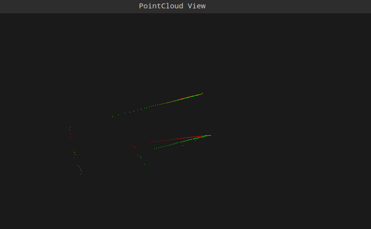
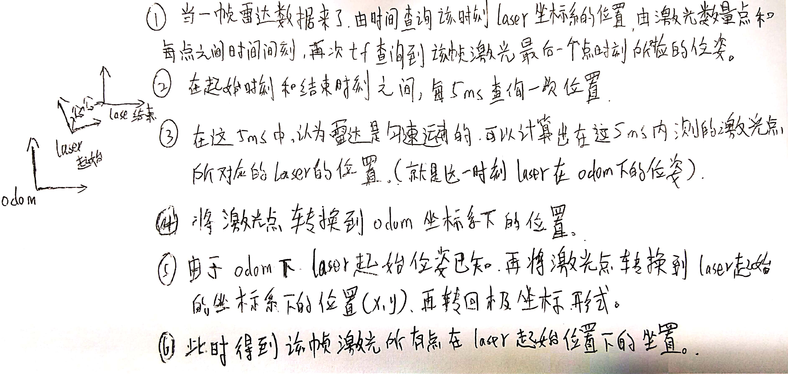

1.  本次的作业为实现一个里程计去除激光雷达运动畸变的模块
2.  本次的作业里面有两个工程:champion_nav_msgs和laser_undistortion；一起编译即可。

本次程序的运行过程为：

1.  理解LidarMotionCalibration函数。
2.  roslaunch laser_undistortion LaserUndistortion.launch  
3.  进入到 /bag目录下，运行指令：rosbag play - -clock laser.bag。
4.  如果一切正常，则会看到pcl的可视化界面，当可视化界面中存在数据的时候，==按R键即可看到结果。红色为畸变矫正前，绿色为畸变矫正后。==



## 代码解读

### 激光回调函数入口

​	从LidarMotionUndistortion.cpp的432行的main函数中的LidarMotionCalibrator的构造函数进入激光话题的回调函数，用的是自定义的激光消息类型champion_nav_msgs/ChampionNavLaserScan .重点学会了==tf库的一些查询坐标系相对位置关系的函数==，==pcl点云的写入与显示==，积累一些基本轮子的使用。

```c
void ScanCallBack(const champion_nav_msgs::ChampionNavLaserScanPtr& scan_msg)
{
    //转换到矫正需要的数据
    ros::Time startTime, endTime;
    startTime = scan_msg->header.stamp;

    champion_nav_msgs::ChampionNavLaserScan laserScanMsg = *scan_msg;

    //得到最终点的时间
    int beamNum = laserScanMsg.ranges.size();
    endTime = startTime + ros::Duration(laserScanMsg.time_increment * beamNum);

    // 将数据复制出来
    std::vector<double> angles,ranges;
    for(int i = beamNum - 1; i > 0;i--)
    {   
        double lidar_dist = laserScanMsg.ranges[i];
        double lidar_angle = laserScanMsg.angles[i];

        if(lidar_dist < 0.05 || std::isnan(lidar_dist) || std::isinf(lidar_dist))
            lidar_dist = 0.0;

        ranges.push_back(lidar_dist);
        angles.push_back(lidar_angle);
    }

    //转换为pcl::pointcloud for visuailization

    tf::Stamped<tf::Pose> visualPose;
    if(!getLaserPose(visualPose, startTime, tf_))
    {

        ROS_WARN("Not visualPose,Can not Calib");
        return ;
    }

    double visualYaw = tf::getYaw(visualPose.getRotation());

    visual_cloud_.clear();
    for(int i = 0; i < ranges.size();i++)
    {

        if(ranges[i] < 0.05 || std::isnan(ranges[i]) || std::isinf(ranges[i]))
            continue;

        double x = ranges[i] * cos(angles[i]);
        double y = ranges[i] * sin(angles[i]);

        pcl::PointXYZRGB pt;
        pt.x = x * cos(visualYaw) - y * sin(visualYaw) + visualPose.getOrigin().getX();
        pt.y = x * sin(visualYaw) + y * cos(visualYaw) + visualPose.getOrigin().getY();
        pt.z = 1.0;

        // pack r/g/b into rgb
        unsigned char r = 255, g = 0, b = 0;    //red color
        unsigned int rgb = ((unsigned int)r << 16 | (unsigned int)g << 8 | (unsigned int)b);
        pt.rgb = *reinterpret_cast<float*>(&rgb);

        visual_cloud_.push_back(pt);
    }
    std::cout << std::endl;

    //进行矫正
    Lidar_Calibration(ranges,angles,
                      startTime,
                      endTime,
                      tf_);
    
    //转换为pcl::pointcloud for visuailization
    for(int i = 0; i < ranges.size();i++)
    {

        if(ranges[i] < 0.05 || std::isnan(ranges[i]) || std::isinf(ranges[i]))
            continue;

        double x = ranges[i] * cos(angles[i]);
        double y = ranges[i] * sin(angles[i]);


        pcl::PointXYZRGB pt;
        pt.x = x * cos(visualYaw) - y * sin(visualYaw) + visualPose.getOrigin().getX();
        pt.y = x * sin(visualYaw) + y * cos(visualYaw) + visualPose.getOrigin().getY();
        pt.z = 1.0;

        unsigned char r = 0, g = 255, b = 0;    // green color
        unsigned int rgb = ((unsigned int)r << 16 | (unsigned int)g << 8 | (unsigned int)b);
        pt.rgb = *reinterpret_cast<float*>(&rgb);

        visual_cloud_.push_back(pt);
    }

    //进行显示
    g_PointCloudView.showCloud(visual_cloud_.makeShared());
}
```

###主要思想流程

​	以5ms为单位线性插值的计算当前帧的当前5ms内每一个激光点所对应的自身雷达坐标系的位置，求得该点在/odom坐标系下的位置，再转换到当前帧起始点坐标系下的位置，恢复为极坐标形式。最后在PointCloud view中展示出来。 

