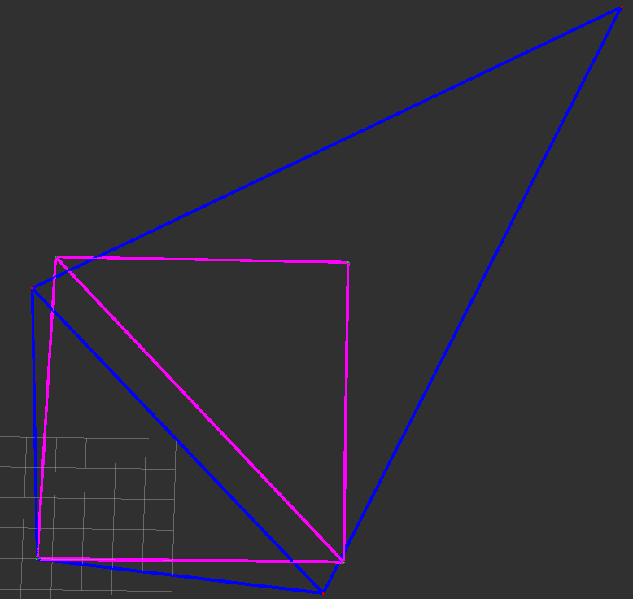
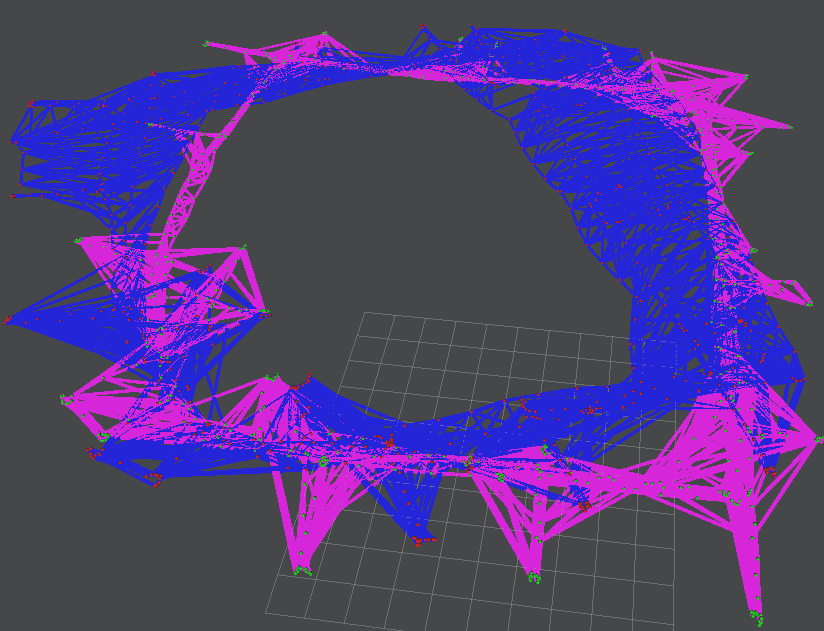
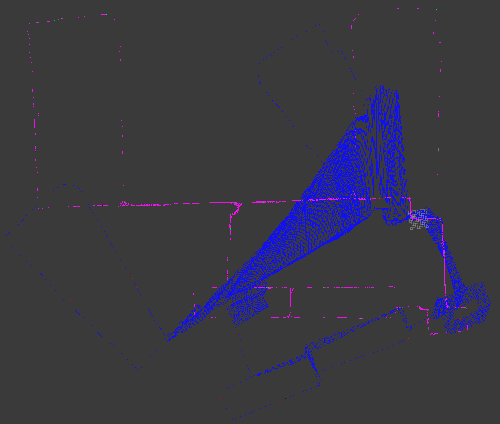
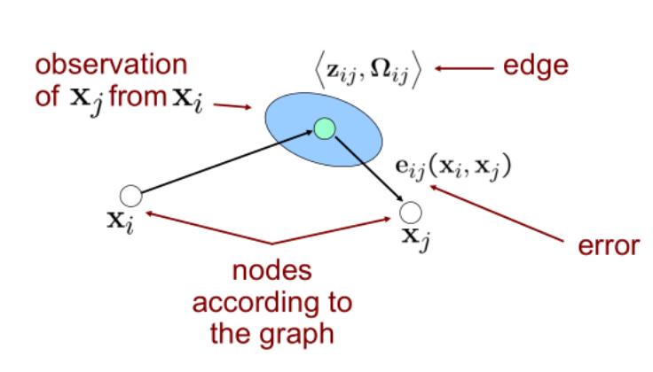
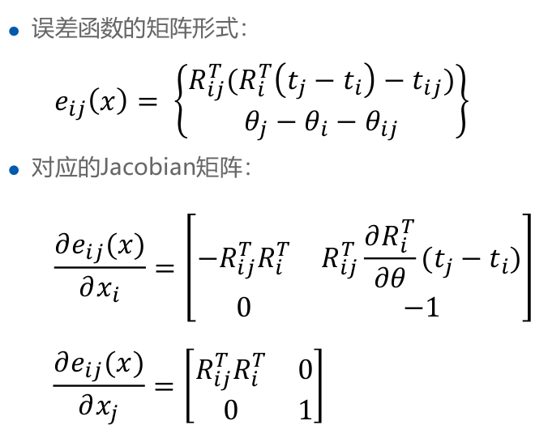
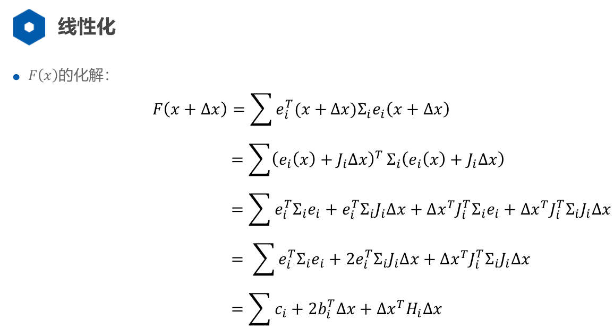

1.	本次的作业为实现高斯牛顿方法来对一个Pose-Graph进行优化
2.	给出的代码内部包含了可视化界面，大家可以用RVIZ的MarkerArray进行查看。优化前和优化后对应的topic为：/beforePoseGraph /afterPoseGraph

本次程序的运行过程为：
1.	文件main.cpp中的main函数中，有文件路径设置，==需要根据自己电脑的路径进行修改==。
2.	实现了==高斯牛顿下降（手写一个BA，理解深刻）==的核心内容，编译通过。
3.	在roscore开启的前提下，运行指令：rosrun ls_slam ls_slam即可
4.	在rviz中查看优化前后PoseGraph的区别。推荐首先选用test_quadrat数据进行计算，如果代码没有错的话，优化完毕之后的PoseGraph是一个稍微有一点不规则的正方向。







​	以上分别是对test_quadrat , intel , killian三个数据集的运行结果，运算量依次递增，最后一个要算非常久。

蓝色为优化前的位姿轨迹，粉色为优化后的位姿轨迹。

​	在main.cpp文件中取消注释，可以更换三个数据集，每次更换需要重新编译。

## 代码流程

### 文本数据集的c++读取

​	在readfile.cpp中手写了一个splitString函数，下面是ReadEdgesInformation函数，将文本中每一条边的信息，包括该边两个顶点的下标，相对位姿和信息矩阵，读取到std::vector<Edge> edges中。

```c
void ReadEdgesInformation(const std::string path,std::vector<Edge>& edges)
{
    std::ifstream fin(path.c_str());
    if(fin.is_open() == false)
    {
        std::cout <<"Read File Failed!!!"<<std::endl;
        return ;
    }

    edges.clear();

    int cnt = 0;
    std::string line;
    while(std::getline(fin,line))
    {
        std::vector<std::string> results;
        results = splitString(line," ");

        cnt++;
        int xi = stringToNum<int>(results[1]);
        int xj = stringToNum<int>(results[2]);

        double dx = stringToNum<double>(results[3]);
        double dy = stringToNum<double>(results[4]);
        double dtheta = stringToNum<double>(results[5]);

        double inf_xx  = stringToNum<double>(results[6]);
        double inf_xy  = stringToNum<double>(results[7]);
        double inf_yy  = stringToNum<double>(results[8]);
        double inf_tt  = stringToNum<double>(results[9]);
        double inf_xt  = stringToNum<double>(results[10]);
        double inf_yt  = stringToNum<double>(results[11]);

        Edge tmpEdge;
        tmpEdge.xi = xi;
        tmpEdge.xj = xj;

        tmpEdge.measurement = Eigen::Vector3d(dx,dy,dtheta);

        tmpEdge.infoMatrix << inf_xx,inf_xy,inf_xt,
                              inf_xy,inf_yy,inf_yt,
                              inf_xt,inf_yt,inf_tt;


        edges.push_back(tmpEdge);
    }

    std::cout <<"Edges:"<<cnt<<std::endl;

    fin.close();
}
```

### visualization_msgs::MarkerArray可视化模板

​	作为一个MarkerArray可视化的学习模板，将顶点和边的信息加入，发布到话题中。

```c
void PublishGraphForVisulization(ros::Publisher* pub,
                                 std::vector<Eigen::Vector3d>& Vertexs,
                                 std::vector<Edge>& Edges,
                                 int color = 0)
{
    visualization_msgs::MarkerArray marray;

    //point--red
    visualization_msgs::Marker m;
    m.header.frame_id = "map";
    m.header.stamp = ros::Time::now();
    m.id = 0;
    m.ns = "ls-slam";
    m.type = visualization_msgs::Marker::SPHERE;
    m.pose.position.x = 0.0;
    m.pose.position.y = 0.0;
    m.pose.position.z = 0.0;
    m.scale.x = 0.1;
    m.scale.y = 0.1;
    m.scale.z = 0.1;

    if(color == 0)
    {
        m.color.r = 1.0;
        m.color.g = 0.0;
        m.color.b = 0.0;
    }
    else
    {
        m.color.r = 0.0;
        m.color.g = 1.0;
        m.color.b = 0.0;
    }

    m.color.a = 1.0;
    m.lifetime = ros::Duration(0);

    //linear--blue
    visualization_msgs::Marker edge;
    edge.header.frame_id = "map";
    edge.header.stamp = ros::Time::now();
    edge.action = visualization_msgs::Marker::ADD;
    edge.ns = "karto";
    edge.id = 0;
    edge.type = visualization_msgs::Marker::LINE_STRIP;
    edge.scale.x = 0.1;
    edge.scale.y = 0.1;
    edge.scale.z = 0.1;

    if(color == 0)
    {
        edge.color.r = 0.0;
        edge.color.g = 0.0;
        edge.color.b = 1.0;
    }
    else
    {
        edge.color.r = 1.0;
        edge.color.g = 0.0;
        edge.color.b = 1.0;
    }
    edge.color.a = 1.0;

    m.action = visualization_msgs::Marker::ADD;
    uint id = 0;

    //加入节点
    for (uint i=0; i<Vertexs.size(); i++)
    {
        m.id = id;
        m.pose.position.x = Vertexs[i](0);
        m.pose.position.y = Vertexs[i](1);
        marray.markers.push_back(visualization_msgs::Marker(m));
        id++;
    }

    //加入边
    for(int i = 0; i < Edges.size();i++)
    {
        Edge tmpEdge = Edges[i];
        edge.points.clear();

        geometry_msgs::Point p;
        p.x = Vertexs[tmpEdge.xi](0);
        p.y = Vertexs[tmpEdge.xi](1);
        edge.points.push_back(p);

        p.x = Vertexs[tmpEdge.xj](0);
        p.y = Vertexs[tmpEdge.xj](1);
        edge.points.push_back(p);
        edge.id = id;

        marray.markers.push_back(visualization_msgs::Marker(edge));
        id++;
    }

    pub->publish(marray);
}

```

### 误差函数的理解



​	如图xi，xj是由里程计得到两点在世界坐标系下的坐标，对应到世界坐标系的转换矩阵就可以得到是Xi，Xj，由雷达观测得到j时刻，在xi的坐标系下的位置是三维向量zij ，可以得到转换矩阵Zij。

​	误差定义就是里程计得到的位置，在雷达观测值位置坐标系下的位置。先求Eij，在转换为三维向量eij，设在xj坐标系下一点m，==点m在世界坐标系下的位置就是Xj×m，也可以是Xi×Zij×Eij×m==。

​	所以Xi×Zij×Eij = Xj，所以Eij = Zij.inv * Xi.inv * Xj 。再转换为向量形式。 Xi.inv * Xj的向量表示xj原点在xi坐标系下坐标。类推。

```c
double ComputeError(std::vector<Eigen::Vector3d>& Vertexs,
                    std::vector<Edge>& Edges)
{
    double sumError = 0;
    for(int i = 0; i < Edges.size();i++)
    {
        Edge tmpEdge = Edges[i];
        Eigen::Vector3d xi = Vertexs[tmpEdge.xi];
        Eigen::Vector3d xj = Vertexs[tmpEdge.xj];
        Eigen::Vector3d z = tmpEdge.measurement;
        Eigen::Matrix3d infoMatrix = tmpEdge.infoMatrix;

        Eigen::Matrix3d Xi = PoseToTrans(xi);
        Eigen::Matrix3d Xj = PoseToTrans(xj);
        Eigen::Matrix3d Z  = PoseToTrans(z);

        Eigen::Matrix3d Ei = Z.inverse() *  Xi.inverse() * Xj;

        Eigen::Vector3d ei = TransToPose(Ei);


        sumError += ei.transpose() * infoMatrix * ei;
    }
    return sumError;
}

```

### 雅克比矩阵推导



​	重点是e由E推来的向量形式， ==Xi.inv * Xj的向量表示xj原点在xi坐标系下坐标。类推。==，然后对xi，xj的(x,y,theta)求导，得到雅克比矩阵。

```c
/**
 * @brief CalcJacobianAndError
 *         计算jacobian矩阵和error
 * @param xi    fromIdx
 * @param xj    toIdx
 * @param z     观测值:xj相对于xi的坐标
 * @param ei    计算的误差
 * @param Ai    相对于xi的Jacobian矩阵
 * @param Bi    相对于xj的Jacobian矩阵
 */
void CalcJacobianAndError(Eigen::Vector3d xi,Eigen::Vector3d xj,Eigen::Vector3d z,
                          Eigen::Vector3d& ei,Eigen::Matrix3d& Ai,Eigen::Matrix3d& Bi)
{
    //TODO--Start
    Eigen::Matrix3d Xi = PoseToTrans(xi);
    Eigen::Matrix3d Xj = PoseToTrans(xj);
    Eigen::Matrix3d Z  = PoseToTrans(z);

    Eigen::Matrix3d Ei = Z.inverse() *  Xi.inverse() * Xj;

    //误差 ei
     ei = TransToPose(Ei);

    Eigen::Matrix2d Rxi = Xi.block(0,0,2,2);
    Eigen::Matrix2d Rij = Z.block(0,0,2,2);

    Eigen::Vector2d ti,tj;
    ti << xi(0),xi(1);
    tj << xj(0),xj(1);

    double theta = xi(2);

    Eigen::Matrix2d dRxi;
    dRxi << -sin(theta),cos(theta),
            -cos(theta),-sin(theta);

    //jacobian
    Ai.setZero();

    Ai.block(0,0,2,2) = - Rij.transpose() * Rxi.transpose();
    Ai.block(0,2,2,1) = Rij.transpose() * dRxi * (tj - ti);
    Ai(2,2) = -1;


    Bi.setZero();
    Bi.block(0,0,2,2) = Rij.transpose() * Rxi.transpose();
    Bi(2,2) = 1;

    //TODO--end
}
```

### 非线性最小二乘优化方程推导



​	==循环每一条边==（约束），求出该边的误差项ei和雅克比矩阵，按上图构造出b和H。叠加。

```c
/**
 * @brief LinearizeAndSolve
 *        高斯牛顿方法的一次迭代．
 * @param Vertexs   图中的所有节点
 * @param Edges     图中的所有边
 * @return          位姿的增量
 */
Eigen::VectorXd  LinearizeAndSolve(std::vector<Eigen::Vector3d>& Vertexs,
                                   std::vector<Edge>& Edges)
{
    //申请内存
    Eigen::MatrixXd H(Vertexs.size() * 3,Vertexs.size() * 3);
    Eigen::VectorXd b(Vertexs.size() * 3);

    H.setZero();
    b.setZero();

    //固定第一帧
    Eigen::Matrix3d I;
    I.setIdentity();
    H.block(0,0,3,3) += I;

    //构造H矩阵　＆ b向量
    for(int i = 0; i < Edges.size();i++)
    {
        //提取信息
        Edge tmpEdge = Edges[i];
        Eigen::Vector3d xi = Vertexs[tmpEdge.xi];
        Eigen::Vector3d xj = Vertexs[tmpEdge.xj];
        Eigen::Vector3d z = tmpEdge.measurement;
        Eigen::Matrix3d infoMatrix = tmpEdge.infoMatrix;

        //计算误差和对应的Jacobian
        Eigen::Vector3d ei;
        Eigen::Matrix3d Ai;
        Eigen::Matrix3d Bi;
        CalcJacobianAndError(xi,xj,z,ei,Ai,Bi);

         //TODO--Start
        Eigen::Matrix3d Hii,Hij,Hji,Hjj;
        Hii = Ai.transpose() * infoMatrix * Ai;
        Hij = Ai.transpose() * infoMatrix * Bi;
        Hji = Bi.transpose() * infoMatrix * Ai;
        Hjj = Bi.transpose() * infoMatrix * Bi;

        int idx = tmpEdge.xi;
        int jdx = tmpEdge.xj;

        H.block(3*idx,3*idx,3,3) += Hii;
        H.block(3*idx,3*jdx,3,3) += Hij;
        H.block(3*jdx,3*idx,3,3) += Hji;
        H.block(3*jdx,3*jdx,3,3) += Hjj;

        Eigen::Vector3d bi,bj;
        bi = (ei.transpose() * infoMatrix * Ai).transpose();
        bj = (ei.transpose() * infoMatrix * Bi).transpose();

        b(3*idx) += bi(0);
        b(3*idx+1) += bi(1);
        b(3*idx+2) += bi(2);

        b(3*jdx) += bj(0);
        b(3*jdx+1) += bj(1);
        b(3*jdx+2) += bj(2);

        //TODO--End
    }


    //求解

    //TODO--Start

   // Eigen::VectorXd dx = H.llt().solve(b);

    Eigen::VectorXd dx = -H.lu().solve(b);

    //TODO-End

    return dx;
}

```

