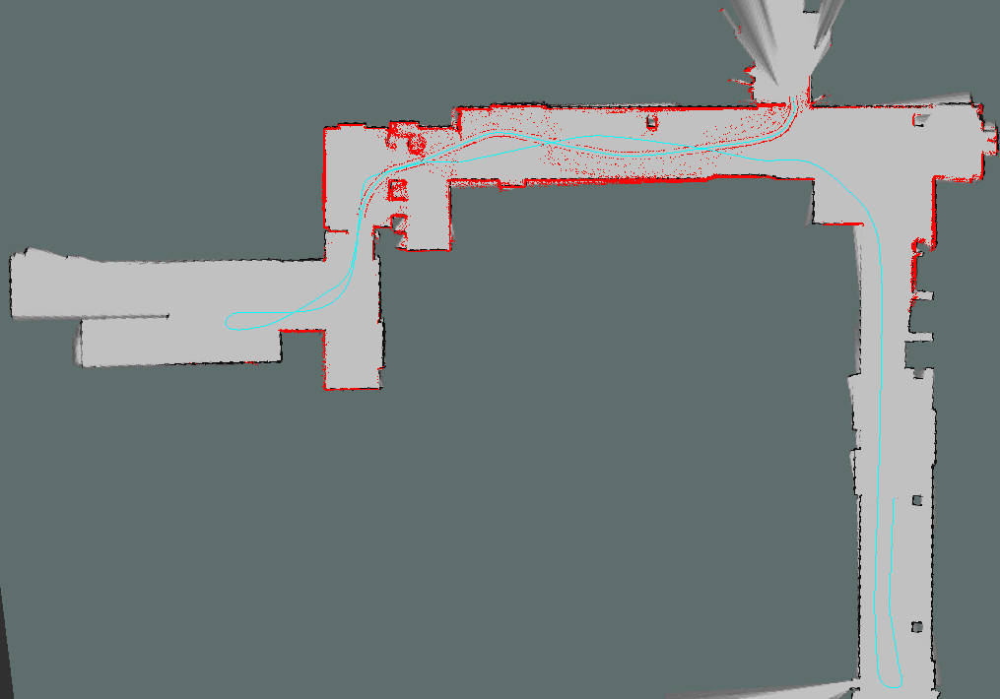
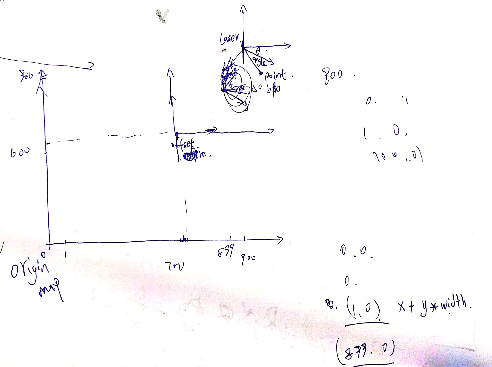

1.	本次的作业为实现一个基于已知定位的建图算法，使用第七课pdf中介绍的Occupany Mapping算法
2.	给出的代码内部包含了可视化界面，大家可以用RVIZ的map查看生成的地图，同时可以添加path和pointcloud查看定位轨迹和激光信息。

3.	本次给出的代码中可以通过readfile.h中的宏定义:READ_DATA_NUMBER来确定要读取的激光数据的帧数，建议前期调试的时候稍微取小一些(例如100)，调试完毕之后再取大，最大不要超过3000.

本次程序的运行过程为：
1.	文件occupany_mapping.cpp中的main函数中，==有文件路径设置，需要根据自己电脑的路径进行修改==。
2.	实现了==覆盖栅格建图算法==，编译通过。
3.	开启roscore的前提下，运行指令：rosrun occupany_mapping occupany_mapping。
4.	在rviz中查看生成的地图，轨迹和激光点云。



​	如图黑色栅格是生成的地图，蓝色为数据读取的已知轨迹，红色为激光的点云，可以发现，在运动过程中轨迹旁边的噪点被成功的过滤掉，没有被生成地图。由于在发布激光点云函数中，只发布了750帧点云数据，一共有3701帧，全部发布太卡了，可以在发布点云函数的xxx变量更改后编译。

## 代码分析

### 文本数据读取

​	和上一讲非线性优化代码ls_slam一样

### 由激光数据更新栅格地图概率



​        坐标系理解清楚了的话，计算上就很好理解了，被激光通过的栅格，是占据的概率-1，被激光击中的栅格是占据的概率+2，一开始所有栅格都是50,概率值始终在0-100之间。遍历所有激光数据，对所有栅格更新，最后概率超过50的黑栅格，低于50的可以通行。栅格地图由一个连续的数组维护，长度为地图的宽×高。

```c
void OccupanyMapping(std::vector<GeneralLaserScan>& scans,std::vector<Eigen::Vector3d>& robot_poses)
{
    std::cout <<"Scans Size:"<<scans.size()<<std::endl;
    std::cout <<"Poses Size:"<<robot_poses.size()<<std::endl;

    //枚举所有的激光雷达数据
    for(int i = 0; i < scans.size();i++)
    {
        GeneralLaserScan scan = scans[i];
        Eigen::Vector3d robotPose = robot_poses[i];

        //机器人的下标
        GridIndex robotIndex = ConvertWorld2GridIndex(robotPose(0),robotPose(1));

        for(int id = 0; id < scan.range_readings.size();id++)
        {
            double dist = scan.range_readings[id];
            double angle = scan.angle_readings[id];

            if(std::isinf(dist) || std::isnan(dist)) continue;

            double theta = robotPose(2);

            //雷达坐标系下的坐标
            double laser_x =  dist * cos(theta + angle);
            double laser_y = -dist * sin(theta + angle); //激光数据的Y轴是反向的。数据的问题，特例。看图片，激光坐标系反向的。

            //世界坐标系下的坐标--激光机器人进行转换

            double world_x = laser_x + robotPose(0);
            double world_y = laser_y + robotPose(1);

            //转换到地图坐标系
            GridIndex mapIndex = ConvertWorld2GridIndex(world_x,world_y);

            //去除超过地图的点．
            if(isValidGridIndex(mapIndex) == false)continue;

            if(isValidGridIndex(robotIndex) == false)
            {
                std::cout <<"Error,This should not happen"<<std::endl;
                continue;
            }

            //得到所有的被激光通过的index，并且更新栅格
            std::vector<GridIndex> freeIndex = TraceLine(robotIndex.x,robotIndex.y,mapIndex.x,mapIndex.y);

            for(int k = 0; k < freeIndex.size();k++)
            {
                GridIndex tmpIndex = freeIndex[k];
                int linearIndex = GridIndexToLinearIndex(tmpIndex);

                int data = pMap[linearIndex];
                data += mapParams.log_free;
                if(data < 0)
                    data = 0;

                pMap[linearIndex] = data;

            }

            //更新被击中的点．
            int tmpIndex = GridIndexToLinearIndex(mapIndex);
            int data = pMap[tmpIndex];
            data += mapParams.log_occ;
            if(data > 100)
                data = 100;
            pMap[tmpIndex] = data;
        }
    }
}
```

### 2D画线算法

​	由雷达坐标系原点和激光终点这两个栅格，计算整条激光线通过的栅格。通过的栅格概率-1.

```c
/**
 * Increments all the grid cells from (x0, y0) to (x1, y1);
 * //不包含(x1,y1)
 * 2D画线算法　来进行计算两个点之间的grid cell
 * @param x0
 * @param y0
 * @param x1
 * @param y1
 */
std::vector<GridIndex> TraceLine(int x0, int y0, int x1, int y1)
{
  GridIndex tmpIndex;
  std::vector<GridIndex> gridIndexVector;

  bool steep = abs(y1 - y0) > abs(x1 - x0);
  if (steep)
  {
    std::swap(x0, y0);
    std::swap(x1, y1);
  }
  if (x0 > x1)
  {
    std::swap(x0, x1);
    std::swap(y0, y1);
  }

  int deltaX = x1 - x0;
  int deltaY = abs(y1 - y0);
  int error = 0;
  int ystep;
  int y = y0;

  if (y0 < y1)
  {
    ystep = 1;
  }
  else
  {
    ystep = -1;
  }

  int pointX;
  int pointY;
  for (int x = x0; x <= x1; x++)
  {
    if (steep)
    {
      pointX = y;
      pointY = x;
    }
    else
    {
      pointX = x;
      pointY = y;
    }

    error += deltaY;

    if (2 * error >= deltaX)
    {
      y += ystep;
      error -= deltaX;
    }

    //不包含最后一个点．
    if(pointX == x1 && pointY == y1) continue;

    //保存所有的点
    tmpIndex.SetIndex(pointX,pointY);

    gridIndexVector.push_back(tmpIndex);
  }

  return gridIndexVector;
}
```

​	